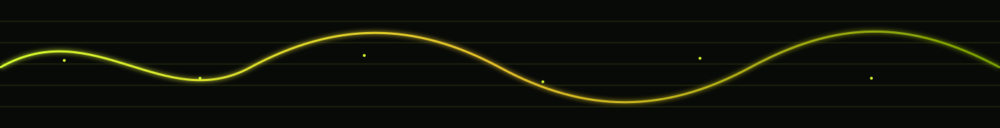
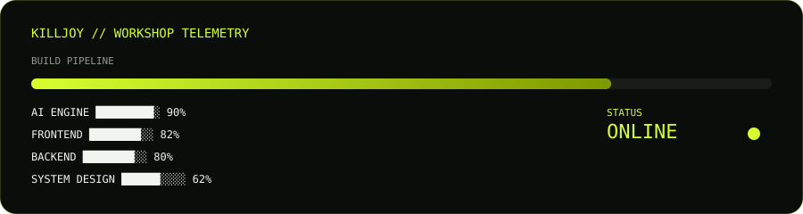

<h1 align="center">Hallo, ich heiße Abinash Anand 👋</h1>

<p align="center">

<!--  -->

</p>

<p align="center">
  
</p>

<p align="center">
  
</p>

<p align="center">
  
</p>

---

<h2>SYSTEM STATUS</h2>

<table>
<tr>

<td width="50%" valign="top">

```text
╭────────────────────────────────────╮
│ USER        ABINASH ANAND          │
│ ROLE        SOFTWARE ENGINEER      │
│ BASE        STUTTGART, DE          │
│ STATUS      ● ONLINE               │
│ MODE        BUILD                  │
│ CURRENT     SOFTWARE × AI          │
╰────────────────────────────────────╯
```

</td>

<td width="50%" valign="top">

### `MISSION DIRECTIVE`

I build software from the **interface down to the architecture and systems that make it work.**

My foundation is in frontend and modern web development, with hands-on experience across backend development, APIs, databases, CI/CD and containerized applications.

I'm increasingly interested in the layer beyond individual features:

**How should the whole system be designed?**

</td>

</tr>
</table>

<!-- <p align="center">
  
</p> -->

---

<h2>🧠 CURRENTLY INSIDE THE WORKSHOP</h2>

<table>
<tr>

<td width="33%" valign="top">

### 🎨 FRONTEND

```text
REACT
ANGULAR
TYPESCRIPT
UI ARCHITECTURE
```

My engineering foundation.

I care about building interfaces that are not only usable, but supported by clean architecture and maintainable code.

</td>

<td width="33%" valign="top">

### 🤖 AI ENGINEERING

```text
LLMs
AI AGENTS
RAG
STRUCTURED OUTPUTS
```

I'm exploring how models, data, APIs, tools and agents can become reliable parts of real software instead of another chatbot demo.

</td>

<td width="33%" valign="top">

### ⚙️ SYSTEMS

```text
NODE.JS
NESTJS
DOCKER
REST APIs
```

I'm going deeper into software architecture, distributed systems and the engineering decisions that determine how applications behave beyond localhost.

</td>

</tr>
</table>

<p align="center">
  
</p>

<p align="center">
  <sub>
    <i>Checking whether the architecture survived the latest experiment...</i>
  </sub>
</p>

---

<h2>⚔️ AGENT LOADOUT</h2>

<p align="center">


</p>

<p align="center">

<code>LANGUAGES</code>
&nbsp;·&nbsp;
<code>FRONTEND</code>
&nbsp;·&nbsp;
<code>BACKEND</code>
&nbsp;·&nbsp;
<code>DATA</code>
&nbsp;·&nbsp;
<code>INFRASTRUCTURE</code>

</p>

<p align="center">
  
</p>

<p align="center">
  <sub>
    <i>
      Me discovering that "just one more technology" has somehow become an entire learning roadmap.
    </i>
  </sub>
</p>

---

<h2>🧬 ENGINEERING DNA</h2>

<table>

<tr>

<td width="50%" valign="top">

### `01` LEARN

I don't want to just know how to use a technology.

I want to understand **why it works, where it fits, and what trade-offs come with it.**

</td>

<td width="50%" valign="top">

### `02` BUILD

The fastest way I learn is by building something real.

Projects expose the gaps that tutorials politely hide.

</td>

</tr>

<tr>

<td width="50%" valign="top">

### `03` QUESTION

A feature can work and still be badly designed.

I care about asking what happens when the system grows, fails, changes, or has to be maintained by someone else.

</td>

<td width="50%" valign="top">

### `04` SHARE

I believe in learning in public.

Build it. Break it. Understand it. Share what happened and why the decisions mattered.

</td>

</tr>

</table>

---

<p align="center">


</p>

<p align="center">
  <sub>
    <b>MODE SWITCH: ARCHITECTURE BRAIN ONLINE</b>
  </sub>
</p>

---

<p align="center">

<!--  -->

</p>

---

<h2>🎯 ACTIVE QUESTS</h2>

```text
╭──────────────────────────────────────────────────────────╮
│                                                          │
│  SOFTWARE ENGINEERING     █████████░░   DEEPENING        │
│                                                          │
│  FRONTEND ARCHITECTURE    ████████░░░   ACTIVE           │
│                                                          │
│  AI ENGINEERING           ███████░░░░   EXPLORING        │
│                                                          │
│  SOFTWARE ARCHITECTURE    ██████░░░░░   DEEPENING        │
│                                                          │
│  DISTRIBUTED SYSTEMS      █████░░░░░░   LOADING          │
│                                                          │
╰──────────────────────────────────────────────────────────╯
```

<p align="center">


</p>

<p align="center">
  <sub>
    <i>
      When the trade-off finally makes sense.
    </i>
  </sub>
</p>

---

<h2>🛠️ WORKSHOP PROTOCOL</h2>

<p align="center">

```text
┌─────────┐      ┌─────────┐      ┌─────────┐      ┌─────────────┐      ┌─────────┐
│  LEARN  │ ───▶ │  BUILD  │ ───▶ │  TEST   │ ───▶ │  UNDERSTAND │ ───▶ │  SHARE  │
└─────────┘      └─────────┘      └─────────┘      └─────────────┘      └─────────┘
     ▲                                                                          │
     │                                                                          │
     └──────────────────────────────────────────────────────────────────────────┘
```

</p>

> My approach is simple: learn → build → understand → test the trade-offs → share.

<p align="center">


</p>

---

<h2>🌐 OPEN CHANNELS</h2>

<p align="center">


</p>

<p align="center">
  <sub>
    <i>Signal detected. Choose your channel.</i>
  </sub>
</p>

<p align="center">

<a href="https://www.linkedin.com/in/abinash-anand-064598203/">
  
</a>

<a href="https://dev.to/abinashanand">
  
</a>

<a href="https://www.leetcode.com/abinash_anand_">
  
</a>

<a href="https://instagram.com/abinash_anand_">
  
</a>

</p>

<p align="center">
  📡 <strong>anandabinash25@gmail.com</strong>
</p>

---

<h2>📡 GITHUB TELEMETRY</h2>

<p align="center">


</p>

<p align="center">


</p>

---

<p align="center">


</p>

<p align="center">
  <sub>
    <b>YOU THOUGHT THE README WAS FINISHED.</b>
  </sub>
</p>

---

<p align="center">

</p>

<p align="center">

<code>LEARN</code>
&nbsp;·&nbsp;
<code>BUILD</code>
&nbsp;·&nbsp;
<code>UNDERSTAND</code>
&nbsp;·&nbsp;
<code>SHARE</code>

</p>

<p align="center">

<sub>
Software Engineer · Stuttgart, Germany · Building from interfaces to systems
</sub>

</p>
